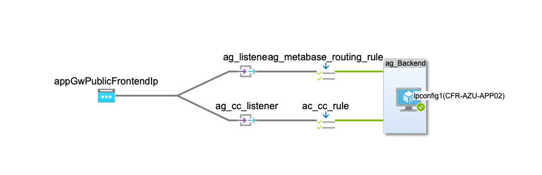

# CF VM Deploy

Manage secrets, and deployment of CF creditcounter-related code and system configuration to target environments.

## Local Development Prerequisites

Install these on your local machine

  * Oracle [VirtualBox](https://www.virtualbox.org) - Oracle's "Free" Virtual Machine. Runs on Linux, MacOS or Windows. 
  * HashiCorp [Vagrant](https://www.vagrantup.com) - Vagrant is a way of conveniently creating, starting and provisioning VMs of all different kinds on your local machine.

## What it does

This repository serves two functions

  1. Build and provision a local VM that runs all docker-compose-specified containers 
  2. Provisions the production VM with package prerequisites and docker-compose containers

When running locally the layering is:

[Your Host] ->runs-> VirtualBox Ubuuntu VM ->runs-> Docker Containers

To ssh into the Ubuntu VM type `vagrant ssh`

From the Ubuntu VM you can cd to the appropriate directory under `/vagrant/compose-projects` then you can `docker-compose ps`, `docker exec -it e2ce77213edd /bin/sh` etc. 

## Starting the System Locally

Prepare your environment by adding the local secrets:

```
source ~/bin/cf-private-vars.sh 
```

An example for this file is available in Bitwarden in the "CF VM Deploy Vagrant secret environment variables" item. A summary of the variables required is:

```
export DOCKER_REGISTRY_NAME=<<UUID>>
export DOCKER_REGISTRY_PASSWORD=<<password>>
export FLOWABLE_HOST=http://localhost:8080
export FLOWABLE_USER=admin
export FLOWABLE_PASSWORD=test
export METABASE_DB_PASSWORD=metabase
```

To get going, simply go to a command line and type (Note: If you change to bridge mode you might have to choose a network adapter to bridge the VM onto your local network):

```!shell
$ vagrant up
```

This process is doing the following:

  1. Vagrant checks to see if there is an ubuntu bionic VM template in the local cache. If not, it downloads it.
  2. Vagrant provisions a VM with the Vagrantfile specifications and starts the VM using VirtualBox
  3. VirtualBox boots the VM and Vagrant installs ssh keys, sets up a vagrant user and executes the "provisioner"
  4. The "provisioner" in this case is "Ansible local" which means that Vagrant installs ansible onto the VM, then provides the ansible playbook.yml with instructions on which packages to install and update. One of the packages is docker-compose
  5. The playbook directs docker-compose to load the relevant docker-compose.yml configurations 
  6. docker-compose starts up our applications

## Getting Started

The Vagrant server is set up to redirect http to https.

When you navigate to http://localhost/test with Chrome you will be confronted with a "this is unsafe" sign. To navigate there anyway type `thisisunsafe` directly into the page (there is no input field to type into)

The available endpoints (as of this writing) are:

  * `/flowable-idm`
  * `/flowable-task`
  * `/flowable-admin`
  * `/flowable-modeler`

## Other commands

If `vagrant up` fails for any reason you can re-run the provisioner with `vagrant down`

If you want to log on to the VM type `vagrant ssh`

To stop the VM `vagrant halt`

To destroy the VM and remove the associated files `vagrant destroy` - this is useful for ensuring a clean start.

## VagrantVM -> Docker Volumes

The directory `vagrant-volumes` contains directories that can be mapped into the VM. For example, this line in [Vagrantfile](Vagrantfile):

```
    config.vm.synced_folder "vagrant-volumes/creditcounter-hasura/data", "/data"
```

Maps your host's `vagrant-volumes/creditcounter-hasura/data` directory into the `/data` directory in the Ubuntu VM. The [compose-projects/creditcounter-hasura/docker-compose.yml](compose-projects/creditcounter-hasura/docker-compose.yml) file specifies a volume:

```
        volumes:
          - /data:/data
```

That maps the Ubuntu VM's `/data` directory into the Flowable container's `/data` directory.

So in short, the content of the `vagrant-volumes/creditcounter-hasura/data` directory is available inside the Flowable container at `/data`

## Port forwarding

When Vagrant is set up to locally NAT (the default) then ports in the VM have to be explicitly forwarded in the Vagrantfile:

```!ruby
  # Create a forwarded port mapping which allows access to a specific port
  # within the machine from a port on the host machine. In the example below,
  # accessing "localhost:8080" will access port 80 on the guest machine.
  # NOTE: This will enable public access to the opened port
  # config.vm.network "forwarded_port", guest: 80, host: 8080
  config.vm.network "forwarded_port", guest: 8010, host: 8010
  config.vm.network "forwarded_port", guest: 5000, host: 5000
```

The 8010 port corresponds to the ports directive in [compose-projects/creditcounter-hasura/docker-compose.yml](compose-projects/creditcounter-hasura/docker-compose.yml) for the Flowable app.

```
        ports:
            - 8010:8080
```

And the 5000 port directive is for the example hello world app in [compose-projects/helloworld/docker-compose.yml](compose-projects/helloworld/docker-compose.yml):

```
    ports:
      - "5000:5000"
```

## Provisioning Production Machines

*Preconditions* Set the ansible group to allow the running user to sudo without password prompt:


```
# Production VM Setup

$ sudo cat /etc/sudoers
#
# This file MUST be edited with the 'visudo' command as root.
#
# Please consider adding local content in /etc/sudoers.d/ instead of
# directly modifying this file.
#
# See the man page for details on how to write a sudoers file.
#
Defaults        env_reset
Defaults        mail_badpass
Defaults        secure_path="/usr/local/sbin:/usr/local/bin:/usr/sbin:/usr/bin:/sbin:/bin:/snap/bin"

# Host alias specification

# User alias specification

# Cmnd alias specification

# User privilege specification
root    ALL=(ALL:ALL) ALL

# Members of the admin group may gain root privileges
%admin ALL=(ALL) ALL

# Allow members of group sudo to execute any command
%sudo   ALL=(ALL:ALL) ALL

# See sudoers(5) for more information on "#include" directives:

#includedir /etc/sudoers.d

# No password required for members of the ansible group

%ansible        ALL=(ALL)       NOPASSWD:ALL
```

Then I added the ansible group and added myself and Andrew to it:

```
sudo addgroup ansible
sudo adduser chrisgentle ansible
sudo adduser andrewornugent ansible
```

## Pulling the repo from gitlab

First `ssh-keygen` to set up a public key. Then add ~/.ssh/id_rsa.pub to your gitlab account's ssh keys. Then clone with ssh into the VM's home directory `git clone git@gitlab.com:cftech/cf-vm-deploy.git` thereafter `git pull` to pick up the latest master branch.

## Starting ansible

First upgrade to the latest ansible:

```
sudo apt-add-repository ppa:ansible/ansible
sudo apt update
sudo apt upgrade
```

## Set up the environment variables in  ~/.secrets/.env and ~/.secrets/env.sh


```
flowable_spring_datasource_username=flowable@cfr-azu-db01
flowable_spring_datasource_password=a_password
flowable_pg_server_fqdn=cfr-azu-db01.postgres.database.azure.com
PGHOST=cfr-azu-db01.postgres.database.azure.com
PGPORT=5432
PGDATABASE=gis1
PGUSER=cc@cfr-azu-db01
PGPASSWORD=cc_db_example_password
registry_name=flatmapit
registry_password=yVS3jrGYHexampleV7ZGk
```

The registry variables are to log in to the gitlab docker container registry at registry.gitlab.com. The username is the account username and the password is a GitLab personal access token or deploy token with registry read access. 

Also set your local shell environment variables:

```
$ source ~/.secrets/env.sh
```

Make sure this and your home directory have sufficiently private permissions.

## Run the pre-requisite docker builds and then the start script

```
$ cd cf-vm-deploy
$ ./prerequisite-setup.sh 
...this will checkout and build the prerequisite docker images into the local registry...
$ bin/ansible-start-prod.sh
...this will start the docker-compose containers and set up nginx...
```

Check on 10.0.1.9/flowable-admin for flowable. 

Rerunning `bin/ansible-start-prod.sh` will pull new any images from the registry and restart the docker containers and nginx. This can be useful for deploying a new copy of CreditCounter.

If you want to shut down the containers run...

```
bin/ansible-stop-prod.sh
```


### Booting Metabase on its own server

Because Metabase likes being on its own server (it likes to make all web assets relative to / and even with the base URL configured it persists on serving assets in this way) we have installed it on 10.0.1.10 (a Centos server).

As a shortcut I manually installed the docker prerequisites and set up the required environment variable in `.bash_profile` (METABASE_DB_PASSWORD=****). 

To launch metabase check out the repository and enter `compose-projects/metabase` and enter this docker-compose command:

```
docker-compose -f prod-docker-compose.yml up -d
```

This server also has a `~/.secrets/.env` file that can be used by ansible, but it is not used for docker-compose.


# Azure Application gateway

An Azure Application Gateway has been created to make CreditCounter and Metabase services 
Internet-accessible. 

  * https://creditcounter.climatefriendly.com 
  * https://metabase.climatefriendly.com 

To provide valid TLS connections the Application Gateway has a listener with a *.climatefriendly.com
SSL certificate installed.

Metabase and CreditCounter both run on 10.0.1.9:



The general model for a gateway is:

```Application Gateway -> listener(s) -> routing rule -> service host:port```

The Application Gateway listens on a public Internet IP address and examines the requested hostname 
to choose the listener to use to handle the request. The Gateway hosts the SSL certificate (and its secret key) for establishing HTTPS/TLS connections. 

The two listeners are for CreditCounter and Metabase. The rules then route the connection to the VM running both services with the appropriate protocol (HTTP/HTTPS) and port for each service.


# Secrets

cat hasura-init.sql | docker secret create hasura_pgsql_init -


# Retool Stage and Dev Deployment

## References

  * Setup https://docs.retool.com/docs/setup-instructions
  * On Premise https://github.com/tryretool/retool-onpremise
  * Git workflow https://docs.retool.com/docs/retool-git-workflow

  